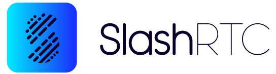

My working journey:

####September 2021

- Currently developing an internal tool that empowers campaign managers to rapidly create and iterate on advertising landing pages. Using large language models (LLMs) and programmatic prompting, built a full-stack (React, Python) application that generates customized, brand-specific advertising pages, seamlessly integrates with the DSP platform, and accelerates the ad creation process.

- Led a team of frontend developers to build and enhance a Demand-Side Platform (DSP) that enables brands and advertisers to run programmatic ad campaigns across top publishing websites. Delivered multiple features, implemented bug fixes, and refactored code to improve performance and maintainability. Key contributions include launching video ad capabilities, developing AI-powered tools for automated title, description, and image suggestions, expanding the media library with stock and generative AI assets, and onboarding new clients with custom features. Ensured smooth collaboration through effective communication with business, management, and technical teams, and maintained high code quality through rigorous peer reviews.

- Collaborated on the migration of the core application from Angular to React, focusing on building reusable UI components, designing robust service layers with efficient HTTP handling, and leveraging React Query for optimized data fetching and state management.

- Designed and developed a Chrome Extension that allows users to preview display ads live on websites, streamlining the ad management workflow for customers.

####October 2020

- Co-developed a CPaaS (Communication Platform as a Service) application offering contact center solutions like tele-calling, customer service dashboards, and operational tools.

- Managed a team of developers and actively contributed to the development of a ticket management tool, integrating it with the company’s dialer systems to streamline customer support and reporting.

- Led a mini-team in upgrading a legacy dialer application, rebuilding the frontend using React and implementing real-time communication via Socket.IO.

- Designed and built custom client dashboards and internal tools for operational efficiency.

####Currently

Exploring React Server Components, frontend system design, DSPY for programmatic prompting for working with LLM based Application, reviewing open source code to get better at understanding and navigating large codebases.

More projects <a href="https://github.com/umeshjain1999" target="_blank">_here_</a>

 Last Updated 15 August, 2025 

